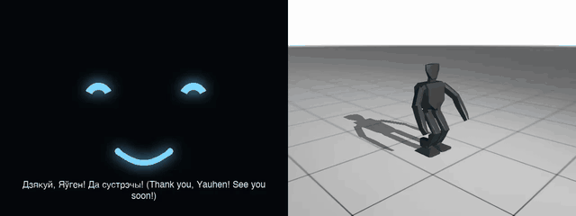

# belarusian-tts

[](https://github.com/YauhenBichel/belarusian-tts/actions/workflows/tests.yml)
[](LICENSE)


Natural, open **Belarusian text-to-speech** (TTS, speech synthesis) you can run yourself: a
native-speaker voice behind an OpenAI-compatible `/v1/audio/speech` endpoint — and the road to a
small, fast Belarusian voice for Piper.

**Беларускае маўленне, якое можна запусціць у сябе.** Сінтэз беларускай мовы з голасам носьбіта
мовы, праз OpenAI-сумяшчальны API.

## Demo

A small humanoid robot ([humanoid-companion](https://github.com/YauhenBichel/humanoid-companion))
says goodbye — «Дзякуй, Яўген! Да сустрэчы!» (Thank you, Yauhen! See you soon!) — in this voice:



▶ **[Before and after, with sound](docs/media/before-after.mp4)** (6 s): first an English voice
reading a phonetic spelling, then belarusian-tts. The generated audio alone:
[`samples/dziakuj-da-sustrechy.wav`](samples/dziakuj-da-sustrechy.wav).

## Why

There is no small, fast, natural open Belarusian voice today:

- Meta MMS has none (there is `mms-tts-ukr` and `mms-tts-rus`, no `mms-tts-bel`);
- Piper's voice collection has none; Kokoro has none;
- an English voice reading a phonetic spelling ("Dzyakuy") sounds foreign — this project started
  when a small humanoid robot said goodbye in Belarusian that way and it sounded awful.

What works today is a large multilingual model cloning a **native Belarusian speaker**. That is
what this repository serves. It is slow on a CPU, so the second half of the project is a small
voice that can run on a Raspberry Pi.

## Use

Linux x86_64, Python 3.12, [uv](https://docs.astral.sh/uv/):

```bash
uv sync --frozen
uv run python server.py                  # 127.0.0.1:11810; the model (~1.2 GB) downloads on first start
curl -s 127.0.0.1:11810/v1/audio/speech -H 'content-type: application/json' \
     -d '{"input": "Дзякуй! Да сустрэчы!"}' -o out.wav
```

Any OpenAI-compatible client works (`model` and `voice` are ignored; `response_format` must be
`wav`; `speed` 0.5–2.0). `GET /healthz` reports the model and the reference voice.

**Speed:** on a 16-thread CPU a 2-second sentence takes about a minute the first time; every
sentence is cached on disk (`BELARUSIAN_TTS_CACHE`, default `~/.cache/belarusian-tts`), so repeats are
instant. Good for fixed phrases and prepared text; not yet for live conversation.

## What kind of model this is

**Text to speech (TTS), also called speech synthesis.** Text goes in, audio comes
out. It is not a language model: it decides how a sentence should *sound*, not
what the sentence should say.

Today that is **OmniVoice**, a zero-shot voice cloning model — it copies the
voice and accent of a short reference recording rather than being trained on one
speaker, which is what makes a Belarusian voice possible without a studio.
The roadmap swaps this for a small **Piper** voice, which is the opposite trade:
one fixed voice, trained once, far smaller and faster. Its sibling is
[belarusian-asr](https://github.com/YauhenBichel/belarusian-asr), which goes the
other way: audio in, text out.

## How it works

- **Model:** [OmniVoice](https://github.com/k2-fsa/OmniVoice) (k2-fsa, Apache-2.0), zero-shot voice
  cloning in 600+ languages including Belarusian.
- **Reference voice:** OmniVoice carries the accent of the reference recording into what it says, so
  the reference must be Belarusian with an exact transcript: a 6-second clip from Google's
  [FLEURS](https://huggingface.co/datasets/google/fleurs) Belarusian set (CC-BY-4.0) —
  see [`ref/SOURCE.md`](ref/SOURCE.md) and [`docs/voices.md`](docs/voices.md) to use another one.
- **Server:** Python standard library HTTP; one synthesis at a time; memory and disk cache.

## Roadmap

1. An evaluation set: sentences covering stress, `ў`, soft consonants, numbers and names, and a
   listening form for native speakers — naturalness is judged by ear, not by a script.
2. A **Piper voice** (VITS, ONNX, real-time on a Raspberry Pi), trained on openly licensed Belarusian
   speech (FLEURS, Mozilla Common Voice).
3. Belarusian text normalisation (numbers, dates).

Contributions, especially from Belarusian speakers, are welcome: [CONTRIBUTING.md](CONTRIBUTING.md).

## Contributors

<!-- readme: contributors,bots/- -start -->
<p align="center">
  <a href="https://github.com/YauhenBichel" title="Yauhen Bichel" aria-label="Yauhen Bichel"></a>
</p>
<!-- readme: contributors,bots/- -end -->

## Where it is used

This voice speaks the Belarusian lines that are spoken rather than sung in the songs and clips of
**Ahni Trasy / Агні трасы**:
[«Chary Nochy» on Spotify](https://open.spotify.com/album/1RG2w6mCmm4GkbOHMQNUse) · [@y6574694 on TikTok](https://www.tiktok.com/@y6574694).
Everything sung or generated there is AI-generated and labelled as such.

## Belarusian language resources

Worth knowing if you work with Belarusian: the **National Corpus of the Belarusian Language**,
[bnkorpus.info](https://bnkorpus.info/) — a 177-million-token corpus with audio search, the
[Grammar Database](https://github.com/Belarus/GrammarDB) (millions of forms with stress and
morphology, CC BY-SA 4.0), the phonetic converter [BelG2P](https://github.com/Belarus/BelG2P) and
the [BelVoice](https://github.com/Belarus/BelVoice) speech framework. This project does not use that data yet; BelG2P is the natural source for Belarusian phonetics, and the Grammar Database for stress.

## Licences

Code: Apache-2.0 ([LICENSE](LICENSE)). Reference recording: FLEURS, CC-BY-4.0 (attribution in
[`ref/SOURCE.md`](ref/SOURCE.md)); the sample in `samples/` was generated by this server with
that reference voice, so the same attribution applies. The OmniVoice model is downloaded from its
authors at first start.

## Disclaimer

Provided as is, without warranty. Generated speech can mispronounce names and numbers; do not use
it where a mistake could cause harm, and it is not a medical or accessibility-certified product.
